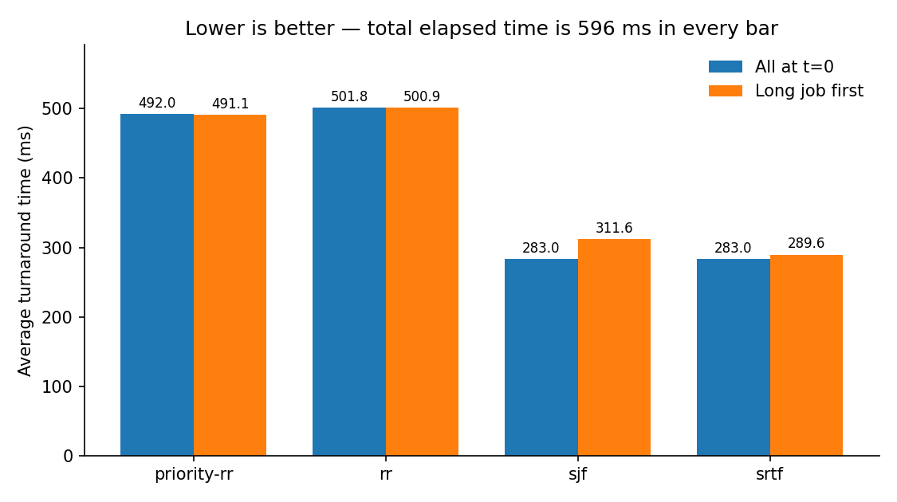

# CPU Scheduler Simulator

A discrete-event simulation of CPU scheduling in C11: four selectable policies,
configurable time quantum, page-fault penalties, and process arrival times. Written for CITS2002 Systems
Programming (UWA).

## Problem

Eight processes compete for a single CPU. Each has a fixed priority (1 = highest,
5 = lowest), a total execution time in milliseconds, and a list of positions in its
own execution progress at which it triggers a page fault.

The scheduler runs in *passes*. On each scheduling decision it considers every
process that is neither finished nor already run in the current pass, and hands the
choice to the active policy. Once every eligible process has had a turn, a new pass
begins.

A scheduled process advances by at most one quantum of real execution progress —
10 ms by default, settable with `--quantum`. Any page fault whose position falls
inside that window costs a flat penalty of wall-clock time (4 ms by default,
settable with `--fault-penalty`) **without** advancing the process's own progress.
A process finishes when its accumulated progress reaches its total execution time;
the program prints its name and the global elapsed time at that moment.

## Build and run

```
gcc -Wall -Wextra src/scheduler.c -o scheduler
./scheduler tests/test_input_1
```

Full usage:

```
./scheduler [--quantum N] [--fault-penalty N] [--policy priority-rr|rr|sjf]
            [--arrivals T1,T2,...] [--stats] [--format human|csv] <input-file>
```

`--quantum` must be at least 1: a quantum of zero would never advance `cpuTime`,
leaving the simulation unable to terminate. `--fault-penalty` may be zero, which
models a machine where faults are free — useful for isolating scheduling behaviour
from fault overhead.

Completion events go to `stdout`, so they can be piped:

```
./scheduler tests/test_input_1 | sort -k2 -n
```

`--arrivals` gives each process a release time, in input-file order:

```
./scheduler --arrivals 0,0,0,0,400,400,400,400 --stats tests/test_input_1
```

Without it every process is available from t = 0, which is what the reference inputs
assume. The count must match the number of processes exactly — a short list is far
more likely to be a typo than a request to default the rest to zero, so it is
rejected rather than padded.

`--stats` writes its summary to `stderr` instead, keeping `stdout` parseable.

`--format csv` switches that summary to a two-line CSV block on `stdout`, and
suppresses the completion events so the stream holds nothing but the table:

```
./scheduler --policy sjf --format csv tests/test_input_1 > data.csv
```

It implies `--stats`, since asking for a machine-readable summary and not wanting
the summary would be a contradiction.

## Scheduling policies

Four policies are available through `--policy`. Two are round-robin variants, one is
non-preemptive, one is preemptive:

| Policy | Picks | Slice |
|---|---|---|
| `priority-rr` (default) | lowest priority value, ties by file order | one quantum |
| `rr` | first eligible process in file order | one quantum |
| `sjf` | smallest total execution time | runs to completion |
| `srtf` | smallest remaining time | one quantum |



Regenerate the chart with `py plot_policies.py`, or get the numbers as a table with
`bash compare_policies.sh tests/test_input_1 [--arrivals ...]`. Neither is needed to
build or test the scheduler.

| Policy | All at t=0 | Long job first |
|---|---|---|
| `priority-rr` | 492.00 | 491.12 |
| `rr` | 501.75 | 500.88 |
| `sjf` | **283.00** | 311.62 |
| `srtf` | **283.00** | **289.62** |

Total elapsed time is 596 ms in every one of those runs, and every run triggers the
same 13 page faults. It is fixed by `sum(total_time) + penalty * faults_triggered`,
so scheduling cannot create throughput — it only decides who waits.

**Why SJF wins when everything arrives at once.** Non-preemptive shortest-job-first
minimizes average turnaround, and the reason is easy to see by exchange: take any two
adjacent jobs where the longer one runs first, and swap them. The shorter job now
finishes earlier by the length of the longer one, the longer job finishes later by the
length of the shorter one, and every job after the pair is unaffected. Since the
shorter job's gain exceeds the longer job's loss, the sum of completion times strictly
drops. Repeat until no such pair remains and you have sorted by length.

**Why it stops winning when jobs arrive late.** The second column releases `P1` — the
longest job — at t = 0 and everything else at t = 1. `sjf` has only one choice at
t = 0, starts `P1`, and cannot put it down: seven short jobs queue behind 96 ms of
work, and average turnaround rises to 311.62. `srtf` starts `P1` too, but drops it one
quantum later when the short jobs appear, finishing at 289.62. The difference is not
that `srtf` chooses better — both make the same choice with the same information. It
is that `srtf` is allowed to change its mind when new information arrives.

**Why the two are identical in the first column.** With every job present from the
start, `srtf` picks the smallest remaining time, runs it for a quantum, and finds that
the same job now has an even smaller remaining time — so it picks it again, and keeps
picking it until it finishes. Its execution order is exactly `sjf`'s, completion time
for completion time. Preemption is worthless when no new information can arrive; its
entire value lies in reacting to arrivals.

**What SJF costs.** Both shortest-first policies are hard on long jobs. `P1` has the
second-highest priority in the input, but neither policy reads the priority field —
they see only that `P1` is the longest, and put it last. With a continuous stream of
arrivals, short jobs would keep displacing long ones and the long ones would never run
at all. Multi-level feedback queues exist to get most of the average-case benefit
without this failure mode.

Selection is reached through a `policy_fn` function pointer, so the scheduling loop
never knows which policy is active. The pointer returns both the chosen process and
the size of its time slice, which is what lets preemptive and non-preemptive policies
share one loop. Policies live in a `POLICIES[]` table that also drives `--policy`
parsing and the usage message, so adding one means adding a row and a function.

## Tests

```
bash run_tests.sh
```

The harness runs every case in `tests/cases/`, compares output against the
expected text, and checks the exit status. It exits non-zero if any case fails, so
it can be wired into CI unchanged.

### Case format

Each `.case` file is one self-contained test — no separate expected-output file to
keep in sync:

```
# args: --stats tests/test_input_1
# stderr: 1
P8 324
...
```

- `# args:` — arguments passed to the binary
- `# exit:` — expected exit status, optional, defaults to `0`
- `# stderr: 1` — fold stderr into the comparison, optional, off by default
- everything else — expected output, verbatim

Adding a test means adding a file; the harness needs no changes.

### Current coverage

| Case | What it pins down |
|---|---|
| `default_1`, `default_2` | the two reference inputs under default settings |
| `quantum_20` | a longer quantum reorders completions but preserves the total |
| `zero_penalty` | with penalties disabled the total collapses to `sum(total_time)` |
| `policy_rr` | ignoring priority changes the order and raises average turnaround |
| `policy_sjf` | a non-preemptive policy runs each process to completion in one slice |
| `policy_srtf` | a preemptive policy re-competes every quantum, ignoring `ran[]` |
| `stats` | the three invariants: total 596, 13 faults triggered, 52 ms penalty |
| `format_csv` | the CSV block, and that completion events are suppressed |
| `arrivals_no_idle` | late arrivals that still leave the CPU continuously busy |
| `arrivals_idle` | arrivals late enough to idle the CPU: total 684, utilisation 79.53% |
| `reject_zero_quantum` | a zero quantum would never advance `cpuTime` — rejected rather than hanging |
| `reject_bad_value` | non-numeric flag values |
| `reject_missing_value` | a flag at the end of `argv` with nothing after it |
| `reject_unknown_policy` | an unrecognised `--policy` name |
| `reject_bad_format` | an unrecognised `--format` name |
| `reject_arrivals_count_mismatch` | an `--arrivals` list whose length is not `nprocs` |
| `reject_no_input` | no input file given |

### Line endings

The binary emits CRLF on Windows and LF elsewhere, so the harness diffs with
`--strip-trailing-cr`. Case files are stored as LF; `.gitattributes` enforces this
on checkout.

## Input format

One process per line:

```
<name> <priority> <total_time> <n_faults> [fault_position ...]
```

Example:

```
P3 2 96 2 20 55
```

P3 has priority 2, needs 96 ms of CPU time, and faults twice — after 20 ms and after
55 ms of its own execution progress. A process with no faults has a count of 0 and
no positions.

## Design notes

**Turnaround is measured from arrival, not from zero.** With every process released
at t = 0 the two are the same, so the distinction was invisible until release times
existed. It stops being invisible immediately: under the idle example above the
average turnaround drops from 492 to 245.50, not because scheduling improved but
because the late processes simply existed for less time.

**Three clocks, deliberately kept separate.** The single largest source of bugs here
is conflating them:

| Quantity | Advanced by | Stored in |
|---|---|---|
| `cpuTime` — a process's own progress | real execution only | `struct process` |
| global elapsed time | real execution **+** fault penalties | `main` |
| quantum | configuration, caps each turn | `struct config` |

**Fault windows are half-open: `[start, end)`.** A quantum advancing progress from
`start` to `end` triggers exactly those faults with `start <= position < end`. This
matters because fault positions in the sample data land precisely on quantum
boundaries. The closed-right alternative `(start, end]` fires every such fault one
quantum early — the total stays correct, but intermediate completion times come out
too high.

**A useful invariant.** The final completion time must equal
`sum(total_time) + penalty * faults_triggered + idle_time`. For sample 1 under
defaults every process is available from the start, so the CPU never idles, the last
term vanishes, and the total is `544 + 52 = 596`; with `--fault-penalty 0` it
collapses further to `544`. Under
`--arrivals 0,0,0,0,400,400,400,400` the first four finish at t = 312 and the rest do
not arrive until t = 400, leaving 88 ms of idle time and a total of 684 — which is
exactly `596 + 88`.

This is the strongest debugging tool in the project. If the last line is right but
earlier lines are wrong, the bug is in fault *timing*, not fault *counting*, which
splits the search space in half before reading any code.

Statistics count faults actually triggered during the simulation rather than the
count declared in the input file. The two agree on this data, but only because every
fault position happens to fall strictly below its process's total time.

**Not every policy wants a pass.** `ran[]` enforces "one turn each before anyone
goes twice", which is what round-robin means and what SRTF must not do — a preemptive
policy has to be able to pick the same process again immediately. Rather than teach
the loop which policies are which, each entry in `POLICIES[]` carries a `uses_pass`
flag, and the eligibility mask consults it. `sjf` sets it too, but only nominally: it
runs each process to completion in one slice, so it is never a candidate twice and the
flag never bites. `srtf` clears it, and for that policy `ran[]` becomes dead weight the
loop still maintains. That is the honest cost of one loop serving four policies.

**An empty selection means two different things.** Once processes have release
times, a policy returning -1 no longer just means "this pass is over". It can also
mean nothing has arrived yet. The loop tells them apart by rescanning for a process
that is unfinished *and* already released: if one exists it is merely blocked by
`ran[]`, so the pass resets and the clock does not move. If none exists the CPU has
nothing to run, and the clock jumps straight to the earliest pending arrival rather
than ticking there one unit at a time — there is nothing to simulate in between. A
guard rejects a computed arrival that is not strictly in the future, since that would
leave the clock stationary and the outer loop spinning forever.

**Policies never see the clock.** Eligibility — unfinished, arrived, not yet run this
pass — is computed by the scheduling loop into an `eligible[]` mask, and the policy
receives only that. Adding release times therefore changed no policy function at all.
`policy_rr` no longer reads `procs` for anything, which is a good sign the mask is
carrying the right amount of information.

**Two output formats, because there are two consumers.** The human summary is
prose-shaped: labelled lines, a percent sign, a header. Anything reading it
programmatically has to match on those labels, so renaming a label silently breaks
the reader. `--format csv` exists so that `compare_policies.sh` reads positional
fields instead: the wording of the human output is then free to change, and only a
deliberate reordering of CSV columns can break anything. Computation lives in
`compute_stats`, which both formats share, so the two can never disagree.

**Streams are captured separately, not merged.** The obvious way to test `--stats`
output is `binary > got 2>&1`. It does not work: `stderr` is unbuffered while
`stdout` becomes block-buffered once it is not a terminal, so the statistics land in
the file before the completion lines that were printed first. The harness redirects
the two streams to separate files and concatenates them in a fixed order.

**Non-preemptive policies collapse the pass loop.** `sjf` gives its chosen process
a slice equal to its remaining time, so the process runs to completion in a single
step and the outer pass loop makes exactly one trip. `ran[]` still works, but its
meaning shifts: under round-robin it records "has used this pass's turn", under a
non-preemptive policy it records "has finished". The structure is redundant rather
than wrong, and left in place because the round-robin policies still need it.

**No dynamic allocation.** All storage is fixed-size arrays with stack duration, as
required by the assignment. Parsing uses a single `sscanf` over twelve conversion
specifiers; its return value is cross-checked against the declared fault count
(`matched == 4 + nfaults`) so malformed and blank lines are rejected rather than
silently producing a garbage process.

## Layout

```
.
├── src/scheduler.c     # simulation and policy implementations
├── tests/              # input workloads
│   └── cases/          # one file per test case
├── docs/ROADMAP.md     # planned extensions
├── docs/policies.png   # committed: README renders it, regenerating needs Python
├── run_tests.sh        # test harness
├── compare_policies.sh # regenerates the policy table from CSV output
├── plot_policies.py    # regenerates docs/policies.png (needs matplotlib)
└── Makefile
```

## Roadmap

See `docs/ROADMAP.md`.